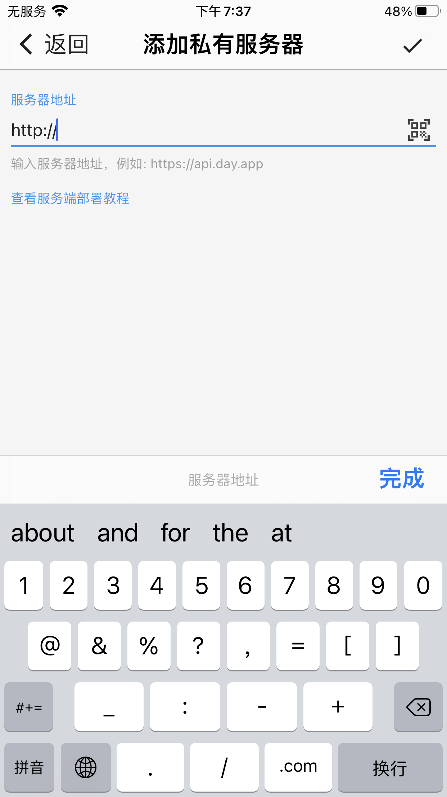
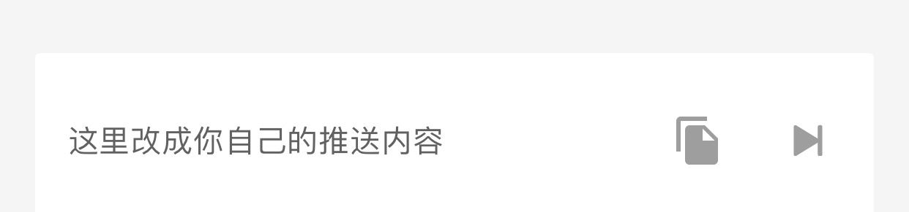
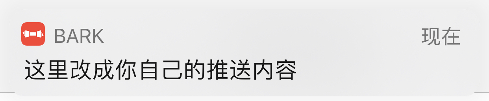
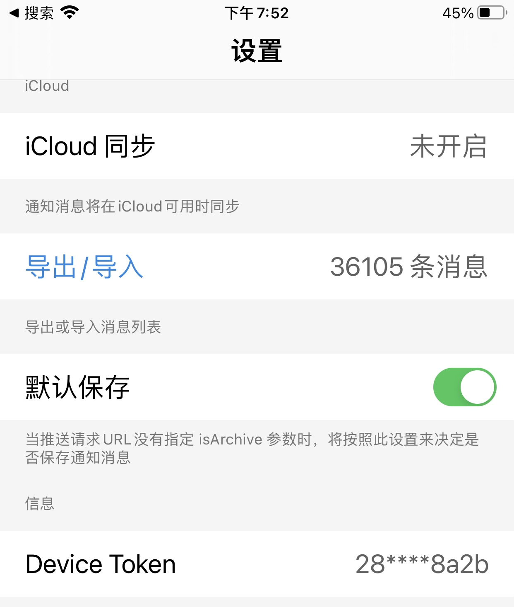

# Bark Setup


### Server

* https://github.com/Finb/bark-server


#####  Docker one method


~~~shelll
 mkdir bark-docker && cd bark-docker
 
 wget https://github.com/Finb/bark-server/releases/download/v2.1.5/Dockerfile
 
 curl -sS https://get.docker.com/ | sh
 systemctl start docker
 systemctl enable docker
 
 docker run -dt --name bark -p 8080:8080 -v `pwd`/bark-data:/data finab/bark-server
  
~~~


##### Docker Two method


  ~~~shell
  mkdir bark-docker && cd bark-docker
  
  wget https://github.com/Finb/bark-server/releases/download/v2.1.5/docker-compose.yaml
  
  docker-compose up -d
  ~~~

  

##### 测试

```
curl http://173.231.173.38:8080/ping
```

返回 pong 就证明部署成功了


### Barknotificator coding

  * Python Version

    https://github.com/funny-cat-happy/barknotificator


* code dir

  /usr/local/lib/python3.10/dist-packages/BarkNotificator

  修改鈴聲

  ~~~shell
  
  
   54     def send(
   55         self,
   56         content: str,
   57         title: str,
   58         target_url: str = None,
   59         ringtone: str = "choo.caf",
   60     ):
   
   
   
  ~~~

   choo.caf 可以去客戶端 https://github.com/Finb/Bark.git 取


### Bark ios 手机客户端设置


直接在添加服务器选项加上http 服务器地址就可以了





* 点▶️，跳入浏览器进行测试





* 出现下面弹出窗口，就证明是正常的了




* 把手机的 device token 发给我

  

### Ref


https://day.app/2018/06/bark-server-document/


