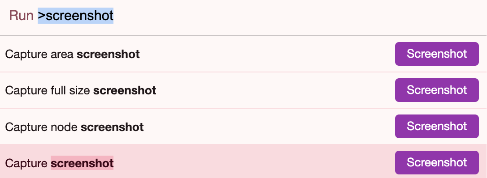

### Some Tips For Macos

> Author: Jello Huang


* Check macbook cpu temperature

  ~~~
  sudo powermetrics|grep temp
  ~~~

  


* zip and encrypt  file

  ~~~
  zip -e file.zip file.txt
  zip -er filefold.zip filefold
  ~~~

  

* macbook  terminal next tab and provious tab  

  ~~~
  next  control+ ⇥ tab
  provious control+shift+ ⇥ tab
  
  ~~~

  

* macos change terminal tag name shortcut

```shell 
Shift+Command+i
```

* How to grep file use find

```shell

# xargs unterminated quote 
find . -iname "*.md" -print0 | xargs -I{} -0 grep -i 寅申巳亥 "{}"


find . -name "*.md" -print0 | xargs  -0 grep "阳干十神表"


```
https://github.com/risc5/risc5/blob/master/print0.md

原因其实很简单, xargs 默认是以空白字符 (空格, TAB, 换行符) 来分割记录的, 因此文件名 ./file 1.log 被解释成了两个记录 ./file 和 1.log, 不幸的是 rm 找不到这两个文件.

为了解决此类问题, 让 find命令在打印出一个文件名之后接着输出一个 NULL 字符 ('') 而不是换行符, 然后再告诉 xargs 也用 NULL 字符来作为记录的分隔符. 这就是 find 的 -print0 和 xargs 的 -0 的来历吧.


##### Howto Make Find Xargs Grep Robust to Spaces in Filenames on a Mac

JUN 24TH, 2012

The unix pattern for filtering files with a predicate then searching within them is `find | xargs | grep`. For example, to search every file whose filename contains notes for a line containing mysql


```
$ find . -iname "*notes*" | xargs grep -i mysql 
```

Unfortunately, on OSX this is not robust to spaces or quotes in filenames. Thus if you have a filename like


```
./Dropquest 2012/Captain's Logs/Chapter 1.txt 
```

in your search path the typical `find | xargs | grep` invocation will terminate with the error


```
xargs: unterminated quote 
```

The first thing to know is you can use the `-t` parameter in `xargs` to at least tell you which filename it’s dying on, but that’s of limited use in making the command work. Even using `-I{}` with `xargs` and `grep` to surround the filename with quotes doesn’t fix this.


```
$ find . -iname "*notes*" | xargs -I{} grep -i mysql "{}" 
```

Many people must have run into this problem because there is a simple solution that all the tools understand: use nulls instead of newlines to delimit files.


```
find . -iname "*.md" -print0 | xargs -I{} -0 grep -i mysql "{}" 
```

```
neofetch
```

and it works!


##### 上面都太难记忆了

~~~shell

find . -name "*.md" -exec grep -Hn "甲乙" {} \;

grep -rin "甲乙" --include="*.md" .


~~~


- `-exec`: 此选项指示 `find` 为每个找到的文件执行命令。
- `grep`: 此命令用于搜索文件中是否存在字符串 "hello world"。
- `-H`: 此选项指示 `grep` 打印文件名以及匹配的行。
- `-n`: 此选项指示 `grep` 打印匹配行所在的行的行号。
- `{}`: 此占位符将替换为正在处理的文件的实际文件名。
- `\;`: 此字符是 `-exec` 命令的终止符。


~~~shell

find . -name "*.md" -exec grep -l "hello world" {} \;


~~~

`-l` 参数表示只输出包含匹配字符串的文件名，而不显示匹配的具体行内容。


### 截长图 屏幕

谷歌浏览器, F12打开开发者模式，使用快捷键 Ctrl+Shift+P，Mac 当中是 Command+Shift+P,输入screenshot，选full，即可以
最近在某个网站上发现，capture full size 无法截取全屏。 可能是网页设置了 body 高度为 100% 所致。去掉该属性即可正常使用




### macbook 休眠问题

macOS 的睡眠有两种状态
不断电，数据存储在内存中，可以快速恢复。我们称这种状态为睡眠（Sleep）
断电，数据存储在硬盘中，恢复得较慢。我们称这种状态为休眠（Hibernate/Stand-by）
睡眠和休眠可以组合出三种模式，由 hibernatemode 控制
hibernatemode = 0，这是桌面设备的默认值。系统只睡眠，不休眠，不将数据存储在硬盘中。
hibernatemode = 3，这是移动设备的默认值。系统默认睡眠，在一定时间后或电量低于阈值将数据存储在硬盘中，而后休眠。这是所谓的安全睡眠（Safe-Sleep）。
hibernatemode = 25。只休眠，不睡眠。
无论是安全睡眠模式还是休眠模式，从磁盘上恢复时，都会需要一定的时间（经测试，大约 3 秒钟）屏幕才会被点亮。
对于 hibernatemode = 3，即安全睡眠模式，又有几个参数来控制细节。

当剩余电量大于 highstandbythreshold（默认 50%）时，在 standbydelayhigh 秒（默认 86,400，即一整天）后进入休眠。
当剩余电量小于 highstandbythreshold 时，在 standbydelaylow 秒（默认 10,800，即三小时）后进入休眠


~~~shell

 When Using Battery
sudo pmset -b hibernatemode 25
sudo pmset -b highstandbythreshold 90
sudo pmset -b standbydelayhigh 3600  # 1 hour
sudo pmset -b standbydelaylow  300  # 5 minute
 When Using AC Power
sudo pmset -c hibernatemode 3
sudo pmset -c highstandbythreshold 80
sudo pmset -c standbydelayhigh 86400  # 24 hours
sudo pmset -c standbydelaylow  10800  # 3 hours
~~~


https://liam.page/2020/07/26/change-hibernatemode-to-save-battery-on-macOS/ 


### Install nginx


~~~shell

brew install nginx


Docroot is: /usr/local/var/www

The default port has been set in /usr/local/etc/nginx/nginx.conf to 8080 so that
nginx can run without sudo.

nginx will load all files in /usr/local/etc/nginx/servers/.

To start nginx now and restart at login:
  brew services start nginx
Or, if you don't want/need a background service you can just run:
  /usr/local/opt/nginx/bin/nginx -g daemon\ off\;
  

~~~


### **安装ubuntu**

| 方案           | 适用于 Intel Mac | 适用于 T2 MacBook Pro 2019 | 适合人群                           |
| -------------- | ---------------- | -------------------------- | ---------------------------------- |
| **t2linux**    | ✅                | ✅（最佳选择）              | 直接开箱即用，无需额外驱动修复     |
| **Ubuntu**     | ✅                | ❌（需手动修复）            | 适合 Ubuntu 用户，愿意手动安装驱动 |
| **Fedora**     | ✅                | ❌（需手动修复）            | 适合喜欢较新内核的用户             |
| **Arch Linux** | ✅                | ❌（需自己编译 T2 驱动）    | 适合高级用户                       |
| **Pop!_OS**    | ✅                | ❌（部分驱动需修复）        | 适合想要易用性的用户               |


### 進入雙系統

* 開機一直按住option按鍵 ，選擇然後進入ubuntu系統
* command+r 進入恢復系統


### Parallels 破解补丁


https://macked.app/parallels-desktop-20-crack.html

https://luoxx.top/archives/pd20-free-share

* 20.2.2
  * https://download.parallels.com/desktop/v20/20.2.2-55879/ParallelsDesktop-20.2.2-55879.dmg
  * 


### Macos破解网站

https://macked.app
