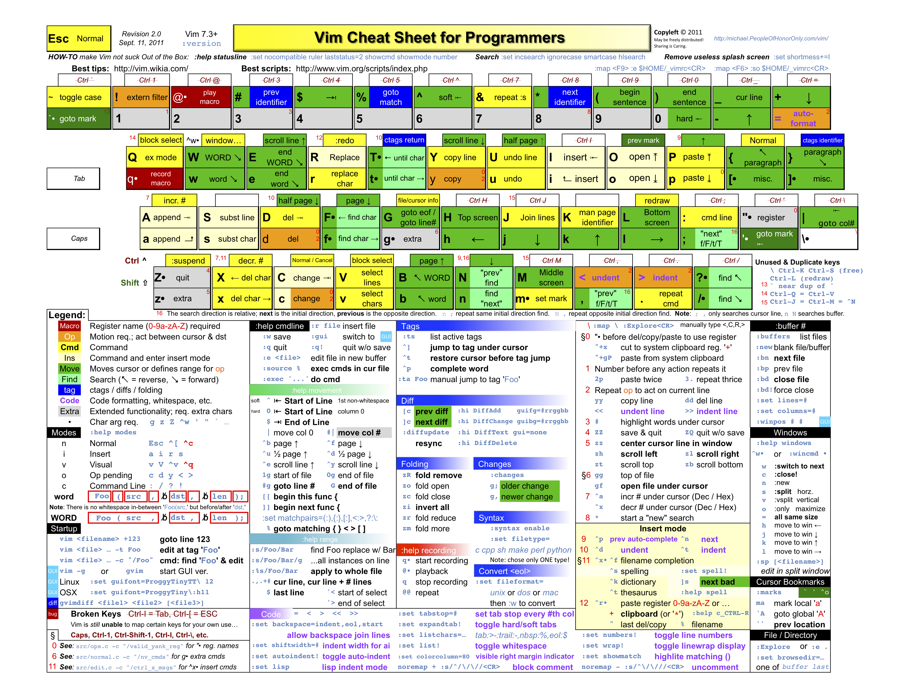

# Vim Cheet Sheet Chinese Version


### REF

 https://github.com/rtorr/vim-cheat-sheet


# Vim Cheet Sheet English Version


### Ref

https://devhints.io/vim


# More Describe Chinese

> https://catbro666.github.io/posts/d6ca5270/


本文不会介绍基本的VIM使用方法，如果你对VIM的几种模式、基本的编辑、移动和选取等还不了解，推荐你先看一下这篇[简明 VIM 练级攻略](https://coolshell.cn/articles/5426.html)，写得还是不错的，基本上最常用的命令都有了。如果你不是vim重度用户的话，知道这些命令已经足够。只能说vim的水太深，根据自身情况在编辑效率和学习成本之间做个平衡吧。


这里有一个vim cheat sheet图，可以作为快速查阅用。要了解具体的命令推荐查看vim的help文档，内容写得非常详细。



## Vim编辑命令一般格式

vim中编辑命令的结构

```
<number> <operator> <number> <text object or motion>
```

motion或对象前可以包含一个数字，如果operator前也带了一个数字，两者是**相乘**的关系。

例如`2d3w`，删除6个单词。

## 操作符

操作符也是可选的，如果没有则变成了移动命令，而非编辑命令。

vim默认的operator有

| 命令  | 作用                                              |
| ----- | ------------------------------------------------- |
| **c** | change                                            |
| **d** | delete                                            |
| **y** | yank into register                                |
| ~     | swap case (only if ‘tildep’ is set)               |
| g~    | swap case                                         |
| gu    | make lowercase                                    |
| gU    | make uppercase                                    |
| !     | filter through an external program                |
| =     | filter through ‘equalprg’ or C-indenting if empty |
| gq    | text formatting                                   |
| g?    | ROT13 encoding                                    |
| >     | shift right                                       |
| <     | shift left                                        |
| zf    | define a fold                                     |
| g@    | call function set with the ‘operatorfunc’ option  |

操作要么影响整行，要么影响起止位置之间的字符。移动有inclusive和exclusive之分。

如果操作pending了（即操作符已经输入了，motion还没有），有一些特殊映射可以使用（:omap）。

motion也可以使用命令，例如`d:call FindEnd()`，如果命令多于一行不能重复。

可以在操作符后输入`v`、`V`或`CTRL-V`，强制将motion转换为逐字符、逐行、逐块。其中对于v，如果本身就是逐字符的，则转换inclusive/exclusive。

扩展的操作符：

| 快捷键     | 命令            | 作用           |
| ---------- | --------------- | -------------- |
| nnoremap Y | :CopyText<cr>   | 拷贝到指定字符 |
| nnoremap D | :DeleteText<cr> | 删除到指定字符 |
| nnoremap C | :ChangeText<cr> | 改写到某个字符 |

成对符号的操作：

| 快捷键 | 例子                                   | 作用                               |
| ------ | -------------------------------------- | ---------------------------------- |
| cs”‘   | “Hello world!” -> ‘Hello world!’       | “改成‘                             |
| cs’<q> | ‘Hello world!’ -> <q>Hello world!</q>  | ‘改成<q>对                         |
| cst”   | <q>Hello world!</q> -> “Hello world!”  | <q>对改成”，t表示完整匹配<q>       |
| ds”    | “Hello world!” -> Hello world!         | 去掉”                              |
| dst    | <q>Hello world!</q> -> Hello world!    | t表示完整匹配<q>，而不是单个<      |
| ysiw]  | Hello world! -> [Hello] world!         | 光标所在单词加括号，右括号不加空格 |
| ysiw{  | Hello world! -> { Hello } world!       | 光标所在单词加括号，左括号加空格   |
| yss)   | { Hello } world! -> ({ Hello } world!) | 整行加()对                         |

可以跟vim-repeat配合，使用`.`重复之前的操作。

## 左右移动

| 操作符      | 作用                                  | inclusive/exclusive |
| ----------- | ------------------------------------- | ------------------- |
| **h**       | 左移                                  | e                   |
| **l**       | 右移                                  | e                   |
| **0**       | 移到行首                              | e                   |
| **^**       | 移到行首第一个非空字符                | e                   |
| **$**       | 移到行尾                              | i                   |
| g_          | 移到行尾第一个非空字符                | i                   |
| **g0**      | 移到当前行屏幕最左字符                | e                   |
| g^          | 移到屏幕行第一个非空字符              | e                   |
| gm          | 类似g0，但是屏幕移动                  | e                   |
| g$          | 屏幕行的最后一个非空字符              | i                   |
| **｜**      | 到当前行的屏幕中的第[count]列         | e                   |
| **f{char}** | 移动到右边第[count]个{char}字符出现处 | i                   |
| **F{char}** | 移动到左边第[count]个{char}字符出现处 | e                   |
| **t{char}** | 移动到右边第[count]个{char}字符前     | i                   |
| **T{char}** | 移动到左边第[count]个{char}字符后     | e                   |
| ;           | 重复最近一个f,t,F,T [count]次         |                     |
| ,           | 重复最近一个f,t,F,T 相反方向[count]次 |                     |

## 上下移动

| 操作符       | 作用                                         | inclusive/exclusive |
| ------------ | -------------------------------------------- | ------------------- |
| **k**        | 上移                                         | i                   |
| **j**        | 下移                                         | i                   |
| gk           | 上移显示行，行折叠时或者与操作符使用时       | e                   |
| gj           | 下移显示行                                   | e                   |
| -            | 上移，在第一个非空字符                       |                     |
| _            | 下移[count] -1行，第一个非空字符             |                     |
| **G**        | 到第[count]行，默认最后一行，第一个非空字符  |                     |
| **gg**       | 到第[count]行，默认第一行，第一个非空字符    |                     |
| :[range]     | 光标跳到[range]的最后一行，相比G不改jumplist |                     |
| **{count}%** | 跳到文件百分之{count}处，第一个非空字符      |                     |

## 单词移动

| 操作符         | 作用                                   | inclusive/exclusive |
| -------------- | -------------------------------------- | ------------------- |
| **w**          | 往前[count]个words                     | e                   |
| **W**          | 往前[count]个WORDS                     | e                   |
| **e**          | 往前到第[count]个words的最后，空行不停 | i                   |
| **E**          | 往前到第[count]个WORDS的最后，空行不停 | i                   |
| **b**          | 往回[count]个words                     | e                   |
| **B**          | 往回[count]个WORDS                     | e                   |
| **ge**         | 往回到第[count]个words的最后           | i                   |
| **gE**         | 往回到第[count]个WORDS的最后           | i                   |
| **<leader> w** | 跳到指定单词处                         |                     |

其中**word**由字母、数字、下划线的序列组成，或者其他非空字符的序列，以空白符分隔。可以用`iskeyword`选项修改。空行也当成一个word。

**WORD**由非空字符序列组成，以空白符分隔。空行也当成一个WORD。

特殊情况：

- `cw`和`cW`当作`ce`和`cE`处理（如果光标在非空字符上的话）
- 当`w`跟操作符一起使用，当最后一个移过的单词是一行最后时，单词尾部成为操作文本的尾部，不是下一行的开始。

## 文本对象移动

| 操作符 | 作用                                                         | inclusive/exclusive |
| ------ | ------------------------------------------------------------ | ------------------- |
| (      | 回移[count]个句子                                            | e                   |
| )      | 前移[count]个句子                                            | e                   |
| {      | 回移[count]个段落                                            | e                   |
| }      | 前移[count]个段落                                            | e                   |
| ]]     | 前移[count]个小节或第1列中的下一个‘{’。如果和操作符一起使用，则也停在第一列的’}’下 | e                   |
| ][     | 前移[count]个小节或第1列中的下一个‘}’                        | e                   |
| [[     | 回移[count]个小节或第1列中的前一个‘{’                        | e                   |
| []     | 回移[count]个小节或第1列中的前一个‘}’                        | e                   |

**句子**：由`.`或`!`或`?`结尾，后面要么时行尾、要么是空格或tab。`.`或`!`或`?`后面可以跟任意数目的’)’、’]’、’”‘、’’’。

**段落**：由空行之后开始，或者由段落宏开始。小节的边界也是段落的边界。注意空行不是段落的边界。

## 文本的对象选取

这是一系列只能在visual模式或者操作符之后才能用的命令。`a`命令选取n个对象，包括空白。`i`命令选取一个内部对象不带空白或者只选取空白，所以`i`命令肯定比`a`命令选得少。

`v3aw`，`d2iw`。

可以跟各种文本对象组合。如aw, iw, aW, iW, as, is句子, ap, ip段落, a], a[, i], i[是[]块，a), a(, ab, i), i(, ib是块，a>, a<, i>, i<是尖括号块，at, it是tag块，a}, a{, aB, i}, i{, iB是块，a”, a’, a`,i”, i’, i`是引用的字符串。

扩展文本对象

| 操作符 | 作用                                 | inclusive/exclusive |
| ------ | ------------------------------------ | ------------------- |
| **if** | 函数文件对象，内部代码块             |                     |
| **af** | 函数文件对象，整个函数               |                     |
| iF     | 函数参数对象，整个函数               |                     |
| **aF** | 函数参数对象，整个函数包含前后的空行 |                     |
| i,     | 内部参数，不包括后面的逗号和空格     |                     |
| a,     | 参数，包含逗号和空格                 |                     |

### 当在操作符后面使用时

- 对于非块对象

  a系列命令，作用于对象及其后面的空白。如果对象后面没有空白或光标在对象之前的空白上，对象前面的空白也包含进来。

  i系列命令，如果光标在对象上，作用于对象；如果光标在空白上，作用于空白

- 对于块对象

  作用于光标所在的块（光标在块内或括号上）。a系列命令包括括号，i系列不包括括号。

### 当在Visual模式使用时

- 如果是刚进入Visual模式

  选择一个对象，就跟前面使用操作符时一样

- 如果不是刚进入visual模式

  对于非块对象，visual区域扩展一个对象或下一个对象前的空白，或者扩展两者。选取方法取决于光标运动方向。对于块对象，往外扩展一层。

### 例子

下面是删除命令为例的一个例子

```
"dl"    delete character (alias: "x")           dl
"diw"   delete inner word                       diw
"daw"   delete a word                           daw
"diW"   delete inner WORD (see WORD)            diW
"daW"   delete a WORD (see WORD)                daW
"dgn"   delete the next search pattern match    dgn
"dd"    delete one line                         dd
"dis"   delete inner sentence                   dis
"das"   delete a sentence                       das
"dib"   delete inner '(' ')' block              dib
"dab"   delete a '(' ')' block                  dab
"dip"   delete inner paragraph                  dip
"dap"   delete a paragraph                      dap
"diB"   delete inner '{' '}' block              diB
"daB"   delete a '{' '}' block                  daB
```

## 搜索替换

也是光标的跳转。在按回车之前可以按**ctrl+j/k**来上下选择。

| 快捷键 | 命令                       | 作用             |
| ------ | -------------------------- | ---------------- |
| map /  | <Plug>(incsearch-forward)  | 往下搜索         |
| map ?  | <Plug>(incsearch-backward) | 往上搜索         |
| map g/ | <Plug>(incsearch-stay)     | 按回车后光标不动 |

| 快捷键             | 命令               | 作用                                           |
| ------------------ | ------------------ | ---------------------------------------------- |
| nnoremap <leader>f | :LeaderfFile .<cr> | 当前目录下文件搜索，tab选择                    |
| nnoremap <leader>F | :Ack!<space>       | 文本正则匹配                                   |
| rr                 |                    | normal下替换掉光标所在单词，visual替换选中文本 |
| nnoremap <leader>r | :ReplaceTo<space>  | 全文替换单词                                   |

## 文件跳转

| 快捷键                      | 命令                              | 作用                        |
| --------------------------- | --------------------------------- | --------------------------- |
| nnoremap <leader>U          | :GoToFunImpl<cr>                  | 跳到函数实现                |
| nnoremap <silent> <leader>a | :Switch<cr>                       | C++头文件和源文件切换       |
| nnoremap <leader>u          | :YcmCompleter GoToDeclaration<cr> | 跳转的函数声明              |
| nnoremap <leader>o          | :YcmCompleter GoToInclude<cr>     | 跳转到include文件           |
| Ctrl + ]                    |                                   | ctags跳转到函数或变量定义处 |
| Ctrl + t                    |                                   | ctags返回跳转前的地方       |

buffer切换

| 快捷键             | 命令                    | 作用                           |
| ------------------ | ----------------------- | ------------------------------ |
| nnoremap <c-p>     | :PreviousBuffer<cr>     | 切换到上一个buffer             |
| nnoremap <c-n>     | :NextBuffer<cr>         | 切换到下一个buffer             |
| nnoremap <leader>d | :CloseCurrentBuffer<cr> | 关闭当前buffer                 |
| nnoremap <leader>D | :BufOnly<cr>            | 删除除当前buffer外的所有buffer |

## git

`:Git`后加对应git命令，还有一些扩展命令，如`:Gread`、`:Ggrep`等。

git commit浏览器。

| 快捷键              | 命令 | 作用                                |
| ------------------- | ---- | ----------------------------------- |
| nnoremap <leader>g  | :GV  | 打开commit浏览器，可以加git log选项 |
| nnoremap <leader>G  | :GV! | 只列出影响当前文件的commits         |
| nnoremap <leader>gg | :GV? | 当前文件revisions的位置列表         |

`:GV`和`:GV?`可以用于visual模式，追踪选择行的变化。

在列表中界面

`o`或`<cr>`，单个commit，显示其内容。

`o`或`<cr>`，多个commits，显示所选范围的变化

`O`，打开一个新tab显示，而不是分隔窗口

```
.`，当前光标所在commit，开始一条命令`:Git [CURSOR] SHA
```

`q`或`gq`关闭

## 自动生成与格式化

CPP辅助

| 快捷键                      | 命令                | 作用                   |
| --------------------------- | ------------------- | ---------------------- |
| nnoremap <leader>y          | :CopyCode<cr>       | 拷贝函数或变量         |
| nnoremap <leader>p          | :PasteCode<cr>      | 生成函数实现或变量定义 |
| nnoremap <leader><leader>fp | :FormatFunParam<cr> | 格式化函数参数         |
| nnoremap <leader><leader>if | :FormatIf<cr>       | 格式化if-else          |
| nnoremap <leader><leader>t  | :GenTryCatch<cr>    | 生成try-catch块        |

文本对齐。

| 快捷键             | 命令               | 作用                                           |
| ------------------ | ------------------ | ---------------------------------------------- |
| nnoremap <leader>= | :Tab /=<cr>        | 关于=号对齐                                    |
|                    | :Tab /,/r1c1l0<cr> | 逗号分隔，右对齐空一个，中对齐空一格左对齐不空 |

快速注释

| 快捷键          | 命令 | 作用                     |
| --------------- | ---- | ------------------------ |
| gcc             |      | 单行注释                 |
| gc              |      | visual模式注释选择行     |
| gcap            |      | 注释一整段               |
| :7,17Commentary |      | 注释所选行               |
| gcgc            |      | 去掉所有相邻注释行的注释 |

新建文件时模版`~/.vim/plugged/prepare-code/snippet`

## vim与shell交互

- `:!command`

不退出vim，执行shell命令，例如`:!ls -l`

- `:!!`

执行上一次的命令

- `:r !command `或`!!command`

将命令执行结果插入到当前行的下一行，例如`:r date`

- `:start,end !command`

将指定行范围中的内容输入到shell命令进行处理，并用输出结果替换指定内容，例如`:62,72 !sort`。

可以只指定单行，`:62 !tr "[a-z]" "[A-Z]"`，将62行转成大写字母。

当前行可以用`.`表示，例如`. !tr "[a-z]" "[A-Z]"`

- `:start,end w !command`

将指定行范围中的内容输入到shell命令进行处理，但是只是显示结果，不会改变当前文件的内容。例如，`:62,72 w !sort`

- `:shell`

不退出vim，新开一个shell，exit之后回到vim。

- `:terminal`或`:vertical :term`

在新建的分割窗口中进入终端。可以用`Ctrl-W N`或`Ctrl-\ Ctrl-N`在终端buffer中进入Normal模式，注意前者的N是大写的，需要按住shift。Terminal-Normal模式下可以选择复制文本。点击`i`键可以返回到Terminal-Job模式。

## 其他命令

| 快捷键                     | 命令                    | 作用                 |
| -------------------------- | ----------------------- | -------------------- |
| nnoremap <silent><leader>t | :TagBarToggle .<cr>     | 显式右边栏，方法变量 |
| nnoremap <silent><leader>n | :NERDTreeToggle .<cr>   | 显式左边栏，文件目录 |
| nnoremap <leader>ff        | :YcmCompleter FixIt<cr> | 自动修复错误         |
| nmap <F5>                  | :YcmDiags<cr>           | 诊断错误             |

## 快捷键映射

map系列命令语法

```
[<mode>][nore]map [<args>] {lhs} {rhs}
```

第一个可选字符表示模式

| 字符 | 模式                                |
| ---- | ----------------------------------- |
| n    | normal only                         |
| v    | visual and select                   |
| o    | operator-pending                    |
| x    | visual only                         |
| s    | select only                         |
| i    | insert                              |
| c    | command-line                        |
| l    | insert, command-line, regexp-search |

noremap 不递归映射

例如，下面的例子是正常的

noremap Y y

noremap y Y

常用的参数有

`<silent>`表示静默映射，不会显示Vim在处理rhs过程中对界面产生的变化。

`<buffer>`表示这个映射只是在当前的buffer中定义，而不是定义全局的映射

`<expr>` 表示{rhs}是一个`Vim表达式` ，而不是按键序列，见下文

表达式的例子如下：

```
noremap  <expr>0     col('.') == 1 ? '^': '0'
```

在normal或visual模式下，按0键可以实现让光标在首列和首个非空白字符之间的切换。

## 插件整理

[vimplus](https://github.com/chxuan/vimplus)是一个vim自动配置工具，基本上包含了下面所有的插件，可以傻瓜式一键安装使用。

### ctags

跳转到标签定义处，需要事先生成索引文件

```
ctags -R .
```

| 快捷键   | 用法                   |
| -------- | ---------------------- |
| Ctrl + ] | 跳转到函数或变量定义处 |
| Ctrl + t | 返回跳转前的地方       |

注意只有在索引所在目录下才能实现跳转

### [chxuan/cpp-mode](https://github.com/chxuan/cpp-mode)

提供生成函数实现、函数声明/实现跳转、.h .cpp切换等功能

| 快捷键                      | 命令                | 作用                   |
| --------------------------- | ------------------- | ---------------------- |
| nnoremap <leader>y          | :CopyCode<cr>       | 拷贝函数或变量         |
| nnoremap <leader>p          | :PasteCode<cr>      | 生成函数实现或变量定义 |
| nnoremap <leader>U          | :GoToFunImpl<cr>    | 跳到函数实现           |
| nnoremap <silent> <leader>a | :Switch<cr>         | C++头文件和源文件切换  |
| nnoremap <leader><leader>fp | :FormatFunParam<cr> | 格式化函数参数         |
| nnoremap <leader><leader>if | :FormatIf<cr>       | 格式化if-else          |
| nnoremap <leader><leader>t  | :GenTryCatch<cr>    | 生成try-catch块        |

### [chxuan/vim-edit](https://github.com/chxuan/vim-edit)

| 快捷键             | 命令              | 作用                                           |
| ------------------ | ----------------- | ---------------------------------------------- |
| nnoremap Y         | :CopyText<cr>     | 拷贝到指定字符                                 |
| nnoremap D         | :DeleteText<cr>   | 删除到指定字符                                 |
| nnoremap C         | :ChangeText<cr>   | 改写到某个字符                                 |
| rr                 |                   | normal下替换掉光标所在单词，visual替换选中文本 |
| nnoremap <leader>r | :ReplaceTo<space> | 全文替换单词                                   |

### [chxuan/prepare-code](https://github.com/chxuan/prepare-code)

新建文件时自动生成代码，模板在`~/.vim/plugged/prepare-code/snippet`目录下

### [chxuan/vim-buffer](https://github.com/chxuan/vim-buffer)

buffer切换

| 快捷键             | 命令                    | 作用                           |
| ------------------ | ----------------------- | ------------------------------ |
| nnoremap <c-p>     | :PreviousBuffer<cr>     | 切换到上一个buffer             |
| nnoremap <c-n>     | :NextBuffer<cr>         | 切换到下一个buffer             |
| nnoremap <leader>d | :CloseCurrentBuffer<cr> | 关闭当前buffer                 |
| nnoremap <leader>D | :BufOnly<cr>            | 删除除当前buffer外的所有buffer |

### [preservim/tagbar](https://github.com/preservim/tagbar)

右边栏，显式方法变量

| 快捷键                     | 命令                | 作用       |
| -------------------------- | ------------------- | ---------- |
| nnoremap <silent><leader>t | :TagBarToggle .<cr> | 显式右边栏 |

### [ycm-core/YouCompleteMe](https://github.com/ycm-core/YouCompleteMe)

| 快捷键              | 命令                              | 作用              |
| ------------------- | --------------------------------- | ----------------- |
| nnoremap <leader>u  | :YcmCompleter GoToDeclaration<cr> | 跳转的函数声明    |
| nnoremap <leader>o  | :YcmCompleter GoToInclude<cr>     | 跳转到include文件 |
| nnoremap <leader>ff | :YcmCompleter FixIt<cr>           | 自动修复错误      |
| nmap <F5>           | :YcmDiags<cr>                     | 诊断错误          |

### [Yggdroot/LeaderF](https://github.com/Yggdroot/LeaderF)

文件模糊搜索，按tab进行选择

| 快捷键             | 命令               | 作用                        |
| ------------------ | ------------------ | --------------------------- |
| nnoremap <leader>f | :LeaderfFile .<cr> | 当前目录下文件搜索，tab选择 |

### [mileszs/ack.vim](https://github.com/mileszs/ack.vim)

ack文本搜索

| 快捷键             | 命令         | 作用         |
| ------------------ | ------------ | ------------ |
| nnoremap <leader>F | :Ack!<space> | 文本正则匹配 |

!表示不自动跳到第一个匹配。

可以考虑替换成[junegunn/fzf.vim]，使用rg/ag更快。

### [easymotion/vim-easymotion](https://github.com/easymotion/vim-easymotion)

normal模式光标快速跳转，visual模式选择到指定位置。

| 快捷键         | 命令                         | 作用           |
| -------------- | ---------------------------- | -------------- |
| map <leader>w  | <Plug>(easymotion-bd-w)      | 选取至指定位置 |
| nmap <leader>w | <Plug>(easymotion-overwin-w) | 跳转到指定位置 |

### [haya14busa/incsearch.vim](https://github.com/haya14busa/incsearch.vim)

文本搜索，其实跟前一个类似，也是光标的跳转。

在按回车之前可以按ctrl+j/k来上下选择。

| 快捷键 | 命令                       | 作用             |
| ------ | -------------------------- | ---------------- |
| map /  | <Plug>(incsearch-forward)  | 往下搜索         |
| map ?  | <Plug>(incsearch-backward) | 往上搜索         |
| map g/ | <Plug>(incsearch-stay)     | 按回车后光标不动 |

### [jiangmiao/auto-pairs](https://github.com/jiangmiao/auto-pairs)

自动补全成对符号

### [preservim/nerdtree](https://github.com/preservim/nerdtree)

显式左边栏，目录。

| 快捷键                     | 命令                  | 作用       |
| -------------------------- | --------------------- | ---------- |
| nnoremap <silent><leader>n | :NERDTreeToggle .<cr> | 显式左边栏 |

### [vim-nerdtree-syntax-highlight](https://github.com/tiagofumo/vim-nerdtree-syntax-highlight)

左边栏文件类型高亮

### [godlygeek/tabular](https://github.com/godlygeek/tabular)

文本对齐。

| 快捷键             | 命令               | 作用                                           |
| ------------------ | ------------------ | ---------------------------------------------- |
| nnoremap <leader>= | :Tab /=<cr>        | 关于=号对齐                                    |
|                    | :Tab /,/r1c1l0<cr> | 逗号分隔，右对齐空一个，中对齐空一格左对齐不空 |

默认是左对齐，下一个字段前空一格。可以通过一个字母加数字指定格式，其中l/c/r分别表示左对齐/居中对齐/右对齐，紧跟的数字表示下一个字段前插入的空格数。如果指定了多个格式会依次使用，用完了再从第一个开始。注意这个分隔符本身也算一个字段。分隔符并不一定是单个字符，其实可以是正则表达式。

### [tpope/vim-fugitive](https://github.com/tpope/vim-fugitive)

集成Git，`:Git`后加对应git命令，还有一些扩展命令，如`:Gread`、`:Ggrep`等。

### [tpope/vim-surround](https://github.com/tpope/vim-surround)

| 快捷键 | 例子                                   | 作用                               |
| ------ | -------------------------------------- | ---------------------------------- |
| cs”‘   | “Hello world!” -> ‘Hello world!’       | “改成‘                             |
| cs’<q> | ‘Hello world!’ -> <q>Hello world!</q>  | ‘改成<q>对                         |
| cst”   | <q>Hello world!</q> -> “Hello world!”  | <q>对改成”，t表示完整匹配<q>       |
| ds”    | “Hello world!” -> Hello world!         | 去掉”                              |
| dst    | <q>Hello world!</q> -> Hello world!    | t表示完整匹配<q>，而不是单个<      |
| ysiw]  | Hello world! -> [Hello] world!         | 光标所在单词加括号，右括号不加空格 |
| ysiw{  | Hello world! -> { Hello } world!       | 光标所在单词加括号，左括号加空格   |
| yss)   | { Hello } world! -> ({ Hello } world!) | 整行加()对                         |

可以跟vim-repeat配合，使用`.`重复之前的操作。

### [tpope/vim-commentary](https://github.com/tpope/vim-commentary)

快速注释

| 快捷键          | 命令 | 作用                     |
| --------------- | ---- | ------------------------ |
| gcc             |      | 单行注释                 |
| gc              |      | visual模式注释选择行     |
| gcap            |      | 注释一整段               |
| :7,17Commentary |      | 注释所选行               |
| gcgc            |      | 去掉所有相邻注释行的注释 |

### [tpope/vim-repeat](https://github.com/tpope/vim-repeat)

`.`操作支持map，支持tpope/vim-repeat等插件。

### [tpope/vim-endwise](https://github.com/tpope/vim-endwise)

if do等尾部补全

### [octol/vim-cpp-enhanced-highlight](https://github.com/octol/vim-cpp-enhanced-highlight)

cpp额外的语法高亮，增加了标准库/boost函数、容器、类型的高亮。

### [vim-airline/vim-airline](https://github.com/vim-airline/vim-airline)

状态栏美化

### [vim-airline/vim-airline-themes](https://github.com/vim-airline/vim-airline-themes)

状态栏主题库

### [ryanoasis/vim-devicons](https://github.com/ryanoasis/vim-devicons)

显示文件类型图表

### [junegunn/vim-slash](https://github.com/junegunn/vim-slash)

光标移动后清除搜索的高亮

### [junegunn/gv.vim](https://github.com/junegunn/gv.vim)

git commit浏览器。

| 快捷键              | 命令 | 作用                                |
| ------------------- | ---- | ----------------------------------- |
| nnoremap <leader>g  | :GV  | 打开commit浏览器，可以加git log选项 |
| nnoremap <leader>G  | :GV! | 只列出影响当前文件的commits         |
| nnoremap <leader>gg | :GV? | 当前文件revisions的位置列表         |

`:GV`和`:GV?`可以用于visual模式，追踪选择行的变化。

在列表中界面

`o`或`<cr>`，单个commit，显示其内容。

`o`或`<cr>`，多个commits，显示所选范围的变化

`O`，打开一个新tab显示，而不是分隔窗口

```
.`，当前光标所在commit，开始一条命令`:Git [CURSOR] SHA
```

`q`或`gq`关闭

### [kana/vim-textobj-user](https://github.com/kana/vim-textobj-user)

自定义文本对象。例如下面定义了`ad`/`id`选取一个日期如`2013-03-16`，`at`/`it`选取一个时间如`22:04:21`

```
call textobj#user#plugin('datetime', {
\   'date': {
\     'pattern': '\<\d\d\d\d-\d\d-\d\d\>',
\     'select': ['ad', 'id'],
\   },
\   'time': {
\     'pattern': '\<\d\d:\d\d:\d\d\>',
\     'select': ['at', 'it'],
\   },
\ })
```

### [kana/vim-textobj-indent](https://github.com/kana/vim-textobj-indent)

indented blocks of lines的文本对象，不知道他指的啥

### [kana/vim-textobj-syntax](https://github.com/kana/vim-textobj-syntax)

语法高亮项目的文本对象

### [kana/vim-textobj-function](https://github.com/kana/vim-textobj-function)

函数的文本对象，af if aF iF

### [sgur/vim-textobj-parameter](https://github.com/sgur/vim-textobj-parameter)

函数参数文本对象，默认是a, i,

### [Shougo/echodoc.vim](https://github.com/Shougo/echodoc.vim)

补全时在命令行显示函数签名。

### [rhysd/clever-f.vim](https://github.com/rhysd/clever-f.vim)

增强的f/F/t/T，多次连续可以只按一个字符，与第一大小写相同则同方向，否则反方向。

### [vim-scripts/indentpython.vim](https://github.com/vim-scripts/indentpython.vim)

python缩进脚本

### [rhysd/github-complete.vim](https://github.com/rhysd/github-complete.vim)

github补全，包括emoji、用户名、仓库名、issue号、链接URL补全。

### [DrwaIt](https://catbro666.github.io/posts/d6ca5270/)

vim画图工具，

| 快捷键             | 命令    | 作用                           |
| ------------------ | ------- | ------------------------------ |
| <leader>di         | :DrawIt | 开始画图模式                   |
| <leader>ds         | :DIstop | 结束画图模式                   |
| <leader>a 选择模式 |         | 画箭头                         |
| <leader>b 选择模式 |         | 画矩形                         |
| <leader>e 选择模式 |         | 画椭圆                         |
| <leader>l 选择模式 |         | 画直线                         |
| <leader>c          |         | 画布增大                       |
| <leader>f          |         | 字符某个填充                   |
| <leader>s          |         | 追加空格至文本宽度（默认78）   |
|                    |         |                                |
| space              |         | 切换画图/擦除模式              |
| r/R                |         | 替换模式                       |
| <>^v               |         | 插入箭头，前面加<leader>粗箭头 |

### [dense-analysis/ale](https://github.com/dense-analysis/ale)

|      |      |
| :--- | ---- |
|      |      |
|      |      |
|      |      |


